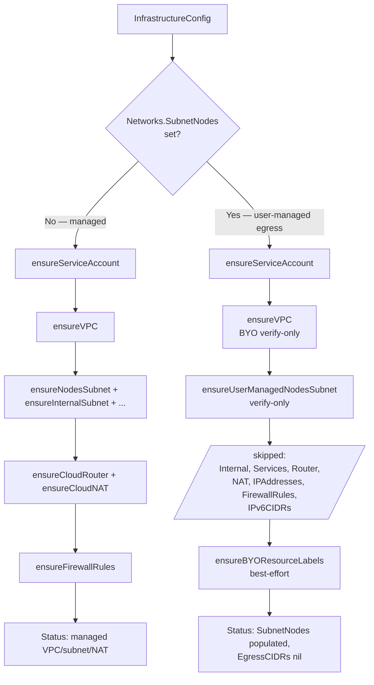

# BYO Infrastructure / User-Managed Egress — Investigation & Plan

Working document. The eventual deliverable is a proper design proposal at
`docs/proposals/flexible-network-configuration.md`. This file captures (a)
what the code does today, (b) what upstream `cloud-provider-gcp` /
`ingress-gce` do at runtime that any BYO design has to compose with, and (c)
the concrete BYO plan we intend to write up.

All paths are relative to the repo root. Line numbers were captured against
the current `HEAD`.

- [1. Investigation — current behavior in `provider-gcp`](#1-investigation--current-behavior-in-provider-gcp)
  - [1.1 API surface](#11-api-surface)
  - [1.2 Validation](#12-validation)
  - [1.3 Reconciler](#13-reconciler)
  - [1.4 Firewall rules created by the reconciler](#14-firewall-rules-created-by-the-reconciler)
  - [1.5 Custom routes and alias-IP ranges](#15-custom-routes-and-alias-ip-ranges)
  - [1.6 Controlplane / CCM `cloud.conf`](#16-controlplane--ccm-cloudconf)
  - [1.7 Bastion](#17-bastion)
  - [1.8 User-facing docs](#18-user-facing-docs)
  - [1.9 Worker-pool network tags and IPAM](#19-worker-pool-network-tags-and-ipam)
- [2. Investigation — upstream mutation contract](#2-investigation--upstream-mutation-contract)
  - [2.1 `cloud-provider-gcp` — `gce.conf` fields](#21-cloud-provider-gcp--gceconf-fields)
  - [2.2 CCM firewall-rule mutation for `Service type=LoadBalancer`](#22-ccm-firewall-rule-mutation-for-service-typeloadbalancer)
  - [2.3 CCM route mutation](#23-ccm-route-mutation)
  - [2.4 Escape hatches for CCM firewall mutation](#24-escape-hatches-for-ccm-firewall-mutation)
  - [2.5 `ingress-gce`](#25-ingress-gce)
  - [2.6 Shared VPC (XPN)](#26-shared-vpc-xpn)
- [3. Plan — BYO infrastructure for `provider-gcp`](#3-plan--byo-infrastructure-for-provider-gcp)
  - [3.1 Scope decisions](#31-scope-decisions)
  - [3.2 API additions](#32-api-additions)
  - [3.3 Derived mode](#33-derived-mode)
  - [3.4 Validation](#34-validation)
  - [3.5 Reconciler](#35-reconciler)
  - [3.6 `InfrastructureStatus`](#36-infrastructurestatus)
  - [3.7 Cloud-provider config (`cloudprovider.conf`)](#37-cloud-provider-config-cloudproviderconf)
  - [3.8 Firewall-rule mutation contract](#38-firewall-rule-mutation-contract)
  - [3.9 Bastion](#39-bastion)
  - [3.10 Metadata tagging on BYO resources](#310-metadata-tagging-on-byo-resources)
  - [3.11 Deletion / teardown](#311-deletion--teardown)
  - [3.12 Configuration patterns](#312-configuration-patterns)
- [4. Open questions to resolve before writing the proposal](#4-open-questions-to-resolve-before-writing-the-proposal)
- [5. Deliverable and workflow](#5-deliverable-and-workflow)
- [6. Potential future issues with upstream components](#6-potential-future-issues-with-upstream-components)
  - [6.1 `cloud-provider-gcp` — evolution of the CCM](#61-cloud-provider-gcp--evolution-of-the-ccm)
  - [6.2 `ingress-gce` — the main watch-item](#62-ingress-gce--the-main-watch-item)
  - [6.3 Route-controller vs. alias-IP transition](#63-route-controller-vs-alias-ip-transition)
  - [6.4 Bastion — worker-tag inference](#64-bastion--worker-tag-inference)
  - [6.5 Fragility summary](#65-fragility-summary)

---

## 1. Investigation — current behavior in `provider-gcp`

### 1.1 API surface

`InfrastructureConfig` (internal `pkg/apis/gcp/types_infrastructure.go:16-21`, v1alpha1
`pkg/apis/gcp/v1alpha1/types_infrastructure.go:16-21`) is trivial — a single
embedded `Networks NetworkConfig`.

`NetworkConfig` (`pkg/apis/gcp/types_infrastructure.go:24-43`,
v1alpha1 `pkg/apis/gcp/v1alpha1/types_infrastructure.go:24-47`) has:

| Field | JSON | BYO today? |
|---|---|---|
| `VPC *VPC` | `vpc` | **yes** — BYO VPC by name (v1alpha1 line 27) |
| `CloudNAT *CloudNAT` | `cloudNAT` | partial — see below |
| `Internal *string` | `internal` | no (CIDR only, always managed) |
| `Worker string` | `worker` | no; **deprecated** in favor of `Workers` |
| `Workers string` | `workers` | no |
| `FlowLogs *FlowLogs` | `flowLogs` | no |
| `MTU *int32` | `mtu` | no; **forbidden when BYO VPC** — comment at v1alpha1 line 42-46 |

`VPC` and `CloudRouter` (`pkg/apis/gcp/types_infrastructure.go:93-105`,
v1alpha1 `pkg/apis/gcp/v1alpha1/types_infrastructure.go:98-111`):

```go
type VPC struct {
    Name        string
    CloudRouter *CloudRouter
}
type CloudRouter struct {
    Name string
}
```

Doc-comment at v1alpha1 line 25-26 declares this the primary BYO switch:
_"VPC indicates whether to use an existing VPC or create a new one."_

`CloudNAT` (`pkg/apis/gcp/types_infrastructure.go:107-158`) is entirely optional.
The only BYO escape hatch inside it is `NatIPNames []NatIPName` at line 121-124
— references to pre-existing GCP external IP address resources by name.

`InfrastructureStatus` (`pkg/apis/gcp/types_infrastructure.go:48-56`) reports back
`Networks.VPC.Name`, `Networks.VPC.CloudRouter.Name` (when set), `Networks.Subnets[]`
(with `PurposeNodes` / `PurposeInternal` / `PurposeServices`), optional `Networks.NatIPs[]`,
`Networks.IPFamilies`, and `ServiceAccountEmail`.

`InfrastructureState` (`pkg/apis/gcp/types_infrastructure.go:172-191`) stores an opaque
`Data map[string]string` (the whiteboard) plus a `Routes []Route` list used only by
the IPv4-to-dual-stack migration path.

**No defaults are registered for `InfrastructureConfig`** — the only `SetDefaults_*`
functions in `pkg/apis/gcp/v1alpha1/defaults.go` are for machine image versions and
storage. Immutability is enforced only in validation, not via CRD annotations.

There are **no** API types for VPC peering, Private Google Access, Private Service
Connect, PSA, shared-VPC / host-project references, or firewall rules — confirmed
via a grep over `pkg/apis/gcp/`.

### 1.2 Validation

Entry points in `pkg/apis/gcp/validation/infrastructure.go`:

- `ValidateInfrastructureConfig` — line 35
- `ValidateInfrastructureConfigUpdate` — line 204
- `ValidateCloudNatConfig` — line 161
- `validateNetworkFlowLogs` — line 137

Current BYO rules on the create path (lines 92-114):

- L92-94 — `vpc.name` must be non-empty if `vpc` is set.
- L96-98 — `vpc.cloudRouter` may not be set when `vpc.name` is empty.
- L100-114 — when `vpc.name` is set (BYO VPC): **`vpc.cloudRouter` is required**;
  `vpc.cloudRouter.name` must be a valid GCP resource name.
- L124-131 — `mtu` is forbidden when `vpc.name` is set; else it must be in `[1300, 8896]`.
- L88-90 — worker CIDR must be a subset of the nodes CIDR.

Immutability (`ValidateInfrastructureConfigUpdate`, lines 214-247):

- L214-216 — removing a previously-set `VPC` is forbidden.
- L219 — `vpc.name` is immutable.
- L220 — `vpc.cloudRouter` is immutable.
- L223-225 — `networks.internal` is immutable **once set** (can be added, cannot be
  changed).
- L241-243 — worker CIDR "can only be expanded" — the check is `newWorker.ValidateSubset(oldWorker)`.
- L245 — `networks.mtu` is immutable.

**Runtime validator** at `pkg/controller/infrastructure/configvalidator.go` currently
only checks that user-supplied `CloudNAT.NatIPNames` refer to existing GCP external
IPs and are not already claimed by another cloud router
(`pkg/controller/infrastructure/configvalidator.go:67-97`). There is **no runtime
validation** today that the referenced VPC or Cloud Router actually exists — that
is delegated to the reconciler and fails hard mid-flow.

### 1.3 Reconciler

`pkg/controller/infrastructure/` is **flow-based only** on the live path.
`Reconcile` (`pkg/controller/infrastructure/actuator_reconcile.go:30-32`) always
delegates to `FlowContext.Reconcile` (constructed at line 66-77). Terraform code
is a **one-shot migration bootstrap**: `migrateFromTerraform`
(`actuator_reconcile.go:102-133`) reads any pre-existing Terraform state and
injects two whiteboard markers before handing off. Comment at line 54:
_"todo(kon-angelo): remove in future release when the terraform library is deprecated."_

Flow package layout — `pkg/controller/infrastructure/infraflow/`:

| File | Responsibility |
|---|---|
| `reconciler.go` | `FlowContext`, whiteboard keys, top-level `Reconcile`/`Delete`, status building |
| `graph.go` | Task dependency graph (reconcile + delete) |
| `ensure.go` | Every `ensureXxx` task body |
| `ensure_utils.go` | Pure "desired state" helpers + BYO predicates `isUserVPC`/`isUserRouter` (line 342-350) |
| `firewall.go` | Firewall-rule name helpers |
| `kubernetes.go` | Filters for CCM-created `k8s-*` firewall rules and `shoot--*` routes |
| `shared/` | Generic flow scaffolding (whiteboard, dependencies) |

Whiteboard keys (`reconciler.go:29-60`): `ObjectKeyVPC`, `ObjectKeyNodeSubnet`,
`ObjectKeyInternalSubnet`, `ObjectKeyServicesSubnet`, `ObjectKeyRouter`,
`ObjectKeyNAT`, `ObjectKeyIPAddresses`, `ObjectKeyRoutes`.

**Create-or-reuse decisions:**

- **VPC** — `ensure.go:58-88`. `isUserVPC` → `ensureUserManagedVPC` (line 90-109),
  which `GetNetwork`s the user-provided name and fails hard if absent
  (line 102-105). Managed path names the VPC after the cluster technical ID
  (`vpcNameFromConfig` at `ensure_utils.go:52-58`).
- **Cloud Router** — `ensure.go:411-465`. `isUserRouter` → `ensureUserManagedCloudRouter`
  (line 447-465) — `GetRouter` by name, fail if absent. Managed path names the router
  `"<clusterName>-cloud-router"` (`ensure_utils.go:72-78`).
- **Subnets** — **always Gardener-managed**. No BYO code path exists.
  - Worker: `ensure.go:275-323`, name `"<clusterName>-nodes"`.
  - Internal: `ensure.go:325-368`, name `"<clusterName>-internal"`.
  - Services (dual-stack only): `ensure.go:370-409`, name `"<clusterName>-services"`.
- **NAT external IPs** — BYO by name only: `ensure.go:467-487` resolves each
  `Networks.CloudNAT.NatIPNames[i].Name` via `GetAddress`, does not create them.
- **Cloud NAT itself** — always Gardener-managed on whatever router is in use
  (`ensure.go:489-518`, upsert against `Router.Nats[]` in `pkg/gcp/client/updater.go:195-266`).
  NAT is scoped `SourceSubnetworkIpRangesToNat: "LIST_OF_SUBNETWORKS"` with only the
  worker subnet listed (`ensure_utils.go:171-177`).

**Reconcile task graph** (`graph.go:17-75`):

```
ensureServiceAccount
ensureVPC
  ├─ ensureKubernetesRoutesCleanupForDualStackMigration
  │    └─ ensureNodesSubnet
  │         └─ ensureAliasIpRanges
  ├─ ensureInternalSubnet
  ├─ ensureServicesSubnet                       (dual-stack only)
  ├─ ensureCloudRouter
  │    └─ ensureCloudNAT                        (depends also on ensureNodesSubnet, ensureIpAddresses)
  ├─ ensureIpAddresses                          (guarded by NatIPNames non-empty)
  ├─ ensureIPv6CIDRs                            (dual-stack)
  └─ ensureFirewallRules
```

**Delete task graph** (`graph.go:77-129`):

```
destroy service account
destroy kubernetes routes
destroy infrastructure firewall
destroy nats                    (only when isUserRouter; else the router-delete cascades)
destroy internal subnet
destroy services subnet         (dual-stack)
destroy router                  (skipped when isUserRouter)
  └─ destroy worker subnet
       └─ destroy vpc           (skipped when isUserVPC)
```

The two BYO predicates `isUserVPC` and `isUserRouter` (`ensure_utils.go:342-350`)
are the sole gating mechanism today; every other resource is Gardener-created.

### 1.4 Firewall rules created by the reconciler

`ensureFirewallRules` (`ensure.go:520-571`) creates two IPv4 rules unconditionally
and two IPv6 mirrors in dual-stack mode. All names come from
`pkg/controller/infrastructure/infraflow/firewall.go`:

| Rule | Direction | Priority | Source | Allowed | Target |
|---|---|---|---|---|---|
| `<clusterName>-allow-internal-access` | INGRESS | 1000 | `networking.pods`, `internal`, `workers` | ICMP; `ipip`; TCP/UDP 1-65535 | **any** VM in the VPC |
| `<clusterName>-allow-health-checks` | INGRESS | 1000 | `35.191.0.0/16`, `209.85.204.0/22`, `209.85.152.0/22`, `130.211.0.0/22` | TCP/UDP 30000-32767 | **any** VM in the VPC |
| `<clusterName>-allow-internal-access-ipv6` | INGRESS | 1000 | IPv6 CIDRs of nodes+services subnets | ICMPv6, `ipip`, TCP/UDP 1-65535 | **any** VM |
| `<clusterName>-allow-health-checks-ipv6` | INGRESS | 1000 | `2600:2d00:1:b029::/64`, `2600:2d00:1:1::/64`, `2600:1901:8001::/48` | TCP/UDP 30000-32767 | **any** VM |

Rule bodies at `ensure_utils.go:236-268` (`firewallRuleAllowInternal`), `:270-302`
(IPv6), and `:320-340` (`firewallRuleAllowHealthChecks`). All use
`NullFields: ["Denied", "DestinationRanges", "SourceServiceAccounts", "SourceTags",
"TargetTags", "TargetServiceAccounts"]` — i.e. they are **not scoped by target tag
or target service account**. They match every VM in the VPC.

This is important for the BYO design: today's rules are additive allows that
apply to the whole VPC. In a shared VPC with other workloads, these rules would
affect those workloads too.

Deletion filter (`ensureFirewallRulesDeleted`, `ensure.go:650-688`) picks up:

- Any rule with name prefix `k8s` **and** a `TargetTag` equal to the shoot's
  technical ID (line 658-663). These are the CCM's runtime-created LB rules.
- The four static rule names above (line 664-671).

`KubernetesFirewallNamePrefix = "k8s"` and `ShootPrefix = "shoot--"` are defined
at `kubernetes.go:16-20`.

### 1.5 Custom routes and alias-IP ranges

The extension does **not** create custom `google_compute_route` resources on the
happy path. It only interacts with them for the IPv4→dual-stack migration flow:

- `ensureKubernetesRoutesCleanupForDualStackMigration` (`ensure.go:137-273`) scales
  the CCM to zero, lists CCM-created routes (prefix `shoot--`, suffix `<vpcName>`,
  next-hop = instance in the cluster), deletes them, and remembers them in
  `InfrastructureState.Routes` for later re-installation as alias-IP ranges.
- `ensureAliasIpRanges` (`ensure.go:721-766`) installs alias-IP routes onto
  instances via `InsertAliasIPRoute`. The secondary range name is
  `"ipv4-pod-cidr"` (`DefaultSecondarySubnetName` at `ensure_utils.go:26-27`).
- `ensureKubernetesRoutesDeleted` (`ensure.go:690-719`) is the delete path.

So for **IPv4-only shoots**: pod-CIDR routes are custom VPC routes written by the
CCM at runtime, named `shoot--<something>-<hex>` with the next-hop being the node
VM. Any BYO-VPC discussion must reason about these because they land in the user's
VPC.

For **dual-stack shoots**: pod IPAM uses alias-IP ranges on the worker subnet
(secondary range `ipv4-pod-cidr`), which is a subnet property, not a VPC route.

`PrivateIpGoogleAccess: false` is set unconditionally on the managed worker subnet
(`ensure_utils.go:102`) with the inline comment _"Gardener GCP shoot clusters
enable PGA by default through a NAT gateway"_. This is the only PGA reference in
the entire repo. VPC peering, PSC, and PSA are entirely absent.

### 1.6 Controlplane / CCM `cloud.conf`

Template — `charts/internal/cloud-provider-config/templates/cloud-provider-config.yaml`
(17 lines, full file):

```yaml
apiVersion: v1
kind: ConfigMap
metadata:
  name: cloud-provider-config
data:
  cloudprovider.conf: |
    [Global]
    project-id="{{ .Values.projectID }}"
    network-name="{{ .Values.networkName }}"
    {{- if .Values.subNetworkName }}
    subnetwork-name="{{ .Values.subNetworkName }}"
    {{- end }}
    multizone=true
    local-zone="{{ .Values.zone }}"
    token-url=nil
    node-tags="{{ .Values.nodeTags }}"
```

Values computed in `pkg/controller/controlplane/valuesprovider.go`
(`getConfigChartValues` at line 422-441, `getNetworkNames` at line 725-747):

| Field | Source | Notes |
|---|---|---|
| `project-id` | `credentialsConfig.ProjectID` | Shoot credential / workload identity |
| `network-name` | `InfrastructureStatus.Networks.VPC.Name`, else `cp.Namespace` | Falls back to shoot technical ID |
| `subnetwork-name` | Subnet with `Purpose == PurposeInternal` (only present if `Networks.Internal` was set) | Conditional |
| `subNetworkNameNodes` | Subnet with `Purpose == PurposeNodes` | Passed to the chart but only referenced from the sibling `cloud-provider-config-ingress-gce.yaml` template |
| `multizone` | Hard-coded `true` | |
| `local-zone` | `cpConfig.Zone` | |
| `token-url` | Hard-coded `nil` | |
| `node-tags` | `cp.Namespace` (= shoot technical ID) | See §1.9 |

The upstream field `network-project-id` (which would express shared-VPC / XPN) is
**not emitted today**.

### 1.7 Bastion

Bastion assumes the worker's `InfrastructureProviderStatus` is populated —
`getInfrastructureStatus` at `pkg/controller/bastion/configvalidator.go:73-112`:

- L79 — reads the `Worker` extension object.
- L92-94 — errors if `Networks.VPC.Name` is empty.
- L96-98 — errors if `Networks.Subnets` is empty.
- L100-108 — errors if no subnet with `Purpose == PurposeNodes` is found.

`validateInfrastructureStatus` (`configvalidator.go:114-138`) does a live
`GetNetwork` / `GetSubnet` and fails if absent. So bastion already tolerates
BYO VPC in principle — it uses whatever the infra status reports.

The bastion always attaches an external `AccessConfig` (public ephemeral IP —
`actuator_reconcile.go:265-273`), so it does **not** depend on Cloud NAT.

Firewall rules created per bastion (`actuator_reconcile.go:121-148`,
`firewallrules.go` + `options.go:199-211`):

| Name suffix | Direction | Priority | Source/dest | Allowed / denied | Target |
|---|---|---|---|---|---|
| `<base>-allow-ssh` | INGRESS | 50 | user CIDRs from `Bastion.Spec.Ingress[].IPBlock.CIDR` (v4 only; v6 rejected at `options.go:146-150`) | TCP 22 | `TargetTags: [BastionInstanceName]` |
| `<base>-egress-worker` | EGRESS | 60 | `WorkersCIDR` | TCP 22 | `TargetTags: [BastionInstanceName]` |
| `<base>-deny-all` | EGRESS | 1000 | `0.0.0.0/0` | denied: all | `TargetTags: [BastionInstanceName]` |

All three attach to `"projects/<projectID>/global/networks/<vpcName>"`
(`options.go:113`) — BYO-VPC compatible today. Bastion firewall rules are
**tag-scoped** (unlike the infra firewall rules), so they only affect the bastion
VM.

`WorkersCIDR` is read from `InfrastructureConfig.Networks.Workers`
(`actuator.go:77-84`), not from `Networks.Subnets`.

### 1.8 User-facing docs

| File | Summary |
|---|---|
| `docs/usage/usage.md` | Main end-user doc. `## InfrastructureConfig` at line 169; documents `networks.vpc` (L205-217, incl. BYO VPC), `networks.workers`, `networks.internal`, `networks.cloudNAT.*` (L222-234), `networks.flowLogs` (L239-245). Egress-CIDR reporting for BYO NAT IPs at L225-228. |
| `docs/usage/ipv6.md` | Dual-stack subnet layout, `ipv4-pod-cidr` secondary range, `STATIC_ROUTES_PER_NETWORK` quota concern for shared VPCs (L116). |
| `docs/usage/gcp-resource-labels.md` | Labels and VM network tags applied to worker nodes and bastion. VM tags at L28-33. |
| `docs/proposals/user-managed-egress-task.md` | This file. |

**No existing doc describes BYO subnets, BYO firewall, custom routing, PSC, or
shared VPC beyond the BYO VPC + BYO CloudRouter combo already documented.**

### 1.9 Worker-pool network tags and IPAM

Every worker node gets three network tags (`pkg/controller/worker/machines.go:232-237`):

```go
"tags": []string{
    w.cluster.Shoot.Status.TechnicalID,                                // e.g. shoot--foo--bar
    fmt.Sprintf("kubernetes-io-cluster-%s", w.cluster.Shoot.Status.TechnicalID),
    "kubernetes-io-role-node",
},
```

The **first** tag (`TechnicalID`) is what ends up as `node-tags` in the CCM's
`cloud.conf` (`valuesprovider.go`, `nodeTags = cp.Namespace`). This is the tag the
CCM uses when programming LoadBalancer firewall rules — critical for the BYO
mutation contract in §2.2 and §3.8.

IPAM:

- Non-dual-stack: pods reach each other via **custom routes** written by the CCM
  (`shoot--*` routes, next-hop=instance).
- Dual-stack: pods use **alias-IP ranges** on the worker subnet (secondary range
  `ipv4-pod-cidr`, `DefaultSecondarySubnetName` at `ensure_utils.go:26-27`;
  machine-class `subnetworkRangeName` references it at
  `pkg/controller/worker/machines.go:249`).

Shared VPC (host-project / service-project) is **not modeled**. The extension
uses `credentialsConfig.ProjectID` as the single project for both the VPC-owning
APIs and the CCM's `project-id`.

---

## 2. Investigation — upstream mutation contract

## 2. Investigation — upstream mutation contract

To reason about what happens in the user's VPC in BYO mode, we need an
inventory of every runtime write that `cloud-provider-gcp` and `ingress-gce`
perform on GCP network resources. The design body (§3.8) is called
"Firewall-rule mutation contract" and refers back to this section.

### 2.1 `cloud-provider-gcp` — `gce.conf` fields

Upstream file: `providers/gce/gce.go:295-328`. The config is a flat `[global]`
section parsed with `gcfg` (INI). Fields relevant for a BYO discussion:

| Field | Purpose |
|---|---|
| `project-id` | The project that owns the cluster's compute resources |
| `network-project-id` | Shared-VPC (XPN): the **host** project that owns the network. Defaults to `project-id`. |
| `network-name` | VPC name |
| `subnetwork-name` | Worker subnet name |
| `node-tags` | Network tag used as `TargetTags` for CCM-created firewall rules |
| `node-instance-prefix` | Prefix used to filter nodes managed by this cluster |
| `token-url` / `token-body` | Only for on-cluster TPM-based auth |
| `secondary-range-name` | For alias-IP mode |
| `local-zone` / `multizone` | Zone scope for the CCM |
| `api-endpoint` / `container-api-endpoint` | Control-plane endpoint overrides |
| `alpha-features` | Feature-gate list |

Compared to more complex cloud-provider config surfaces (e.g. per-resource
resource-group overrides), this is a small surface — there is no outbound-type
enum, no per-Service SNAT toggle, no per-resource RG override. In GCP the
equivalent knob for "the network resources live under a different admin domain"
is `network-project-id`, which shifts the entire VPC into another project.

### 2.2 CCM firewall-rule mutation for `Service type=LoadBalancer`

The upstream GCP CCM's LB controller creates firewall rules for every `Service
type=LoadBalancer`. Naming and scoping:

- Naming: `k8s-fw-<serviceName>` for the main allow rule; `k8s-<hash>-http-hc`
  and similar for health-check rules.
- **Target**: `TargetTags = [<value of node-tags from gce.conf>]`. Always tag-based.
  Never `TargetServiceAccounts`.
- **Source**: `SourceRanges = spec.loadBalancerSourceRanges` (or `0.0.0.0/0`);
  for health-check rules, GCP's LB proxy ranges (`35.191.0.0/16`,
  `130.211.0.0/22`, `209.85.152.0/22`, `209.85.204.0/22`).
- Allowed: TCP/UDP on the Service's node ports.

The rules are named per Service, so the reconciler can identify them for
cleanup by name-prefix. This is exactly what the extension's
`ensureFirewallRulesDeleted` filter picks up: any rule whose name starts with
`k8s` and whose `TargetTags` contain the shoot's technical ID
(`ensure.go:658-663`).

### 2.3 CCM route mutation

With `--configure-cloud-routes=true` (the current default in the Gardener seed
CCM chart for non-dual-stack shoots), the CCM's **route controller** creates
one custom route per node in the VPC:

- Name: `<clusterName>-<hexHash>` — the extension recognizes them as `shoot--*`.
- `DestRange`: the node's pod CIDR.
- `NextHopInstance`: the node VM's self-link.
- `Network`: whatever `network-name` in `gce.conf` says.

Note this places CCM-authored writes in the user's VPC even for a "pure BYO"
setup. In shared-VPC / firewall-egress topologies this may collide with
enterprise route-quota limits (default 400 routes per VPC, extensible to 1000)
and with user-side route-table automation.

### 2.4 Escape hatches for CCM firewall mutation

Critical finding — **there is no per-Service annotation to opt out of
firewall-rule mutation in the GCP CCM**. GCP firewall rules are per-Service
objects (not shared containers), so the natural equivalent of "disable this
LB's firewall writes" would be `spec.loadBalancerClass = <non-GCE>`, which
cedes the entire Service to a different controller.

The other de-facto escape hatch is **XPN (shared-VPC) mode**: when
`network-project-id ≠ project-id` the CCM tolerates 403s on firewall-rule creation
and emits a Kubernetes Event containing the `gcloud compute firewall-rules create
...` command the user must run themselves. This is not a general opt-out — it is
a shared-VPC-only best-effort behavior.

### 2.5 `ingress-gce`

`ingress-gce` (the GKE ingress controller for L7 external LBs) mutates firewall
rules, forwarding rules, backend services, health checks, URL maps, and target
proxies. It creates firewall rules with names like `k8s-fw-l7-*` that allow
GCP's LB proxy ranges to reach node ports.

**In Gardener today, `ingress-gce` is not deployed by this extension.** Only
`cloud-provider-gcp` (the CCM) is deployed. Users who need L7 GCP LBs must
opt in to `ingress-gce` themselves as a shoot add-on. This means:

- The BYO design does **not** need to reason about `ingress-gce` firewall
  mutations as a Gardener-owned surface.
- We should mention it in "user responsibilities" and in the deletion-filter
  section — `ensureFirewallRulesDeleted`'s `k8s`-prefix + `TargetTag` filter
  already picks up ingress-gce-authored rules, so if a user does deploy
  `ingress-gce`, its rules are still garbage-collected on shoot deletion.

### 2.6 Shared VPC (XPN)

Shared VPC is expressed in `gce.conf` via **`network-project-id`** (the host
project) versus `project-id` (the service project — where the workloads and
LBs live).

The CCM's IAM story for XPN: the service-project's Kubernetes SA needs read
access to the host-project VPC and rights to create forwarding rules /
firewall rules in the host project. When it does not have those rights, the
CCM emits Events with the exact `gcloud` command to run.

Gardener today has zero support for XPN. Adding it is a natural v1 or v1.5
step in the BYO design (see §3.1).

---

## 3. Plan — BYO infrastructure for `provider-gcp`

### 3.1 Scope decisions

1. **Derived mode**, no new `OutboundType`/`Mode` enum. Presence of BYO
   references on `Networks` signals the mode.
2. **Two topologies covered by v1**, collapsed under one API signal:
   - **BYO worker subnet with user-owned egress** — the user pre-configures a
     `0.0.0.0/0` route in their VPC toward a customer NVA, VPN tunnel,
     Interconnect, or their own Cloud NAT. Gardener neither knows nor cares
     what the user routes to.
   - **No-egress / network-isolated shoot** — same BYO subnet shape; the user
     simply does not configure any default route. Gardener neither creates nor
     validates the absence of egress.

   Both are signaled by `Networks.SubnetNodes` being set. The reconciler treats
   them identically — it creates no network-layer resources in the user's VPC
   in either case.
3. **Cloud NAT is out of scope in BYO mode, and there is no future "BYO Cloud
   NAT" API field.** Rationale: Cloud NAT is a Cloud-Router-attached resource
   that source-NATs specific subnets. In BYO-subnet mode Gardener owns neither
   the router nor the egress topology, so it has no reason to reference a NAT
   gateway. If the user wants NAT egress they attach their own Cloud NAT to
   their own router pointing at their own subnet — entirely out-of-band from
   Gardener.
4. **Cloud Router (`Networks.VPC.CloudRouter`) is forbidden in BYO-subnet
   mode.** Same rationale: the Cloud Router's only purpose in the current
   codebase is to host the managed Cloud NAT. If Gardener is not creating NAT,
   there is nothing for the extension to do with a router — even a
   user-provided one. Any router the user has for their own NAT / BGP /
   dynamic-routing needs is theirs to manage.
5. **Dual-stack is supported in v1 BYO mode**, with one small API addition
   (`SubnetReference.PodSecondaryRangeName`, §3.2). Without it, the user would
   be forced to name their subnet's IPv4 pod secondary range exactly
   `ipv4-pod-cidr`, which is an unreasonable naming constraint to inherit from
   an internal implementation detail (see §3.2 note).
6. **Deferred to future work:**
   - Shared VPC (`network-project-id` / host-project). Requires emitting a new
     field in `cloudprovider.conf` and an IAM preflight against the host
     project. Noted so `Networks.VPC` can grow a `HostProjectID` field without
     a breaking rename later.
   - BYO firewall rules as a first-class API field. GCP firewall rules are
     per-Service objects and the CCM's runtime writes are tag-scoped (§2.2), so
     no BYO API field is required to make BYO topologies work — the extension
     simply stops creating its own untargeted allow rules in BYO mode, and the
     user takes over. See §3.8.
   - BYO internal subnet (`Networks.SubnetInternal`) — needed only if a user
     wants an internal LB subnet under BYO. Deferred pending demand.
   - BYO services subnet (`Networks.SubnetServices`) for dual-stack shoots — as
     above.
   - Per-zone BYO subnets. GCP subnets are regional (span all zones in a
     region), so the per-zone BYO shape from other providers does not apply
     here. Deferred pending demand.
   - In-place transitions between managed and BYO modes on an existing shoot.
   - `configure-cloud-routes=false` knob for shoots using overlay CNIs — would
     stop the CCM from writing per-node routes into the user's VPC.

### 3.2 API additions

Extend `NetworkConfig` (`pkg/apis/gcp/types_infrastructure.go` and v1alpha1
mirror) with a single new optional field. The shape is deliberately small —
GCP has exactly one worker subnet per shoot (regional), Cloud NAT/Router are
out of scope in this mode (§3.1), and the extension only needs enough
information to reference the pre-existing subnet.

```go
// SubnetNodes is an optional reference to an already-existing GCP subnetwork inside the
// (also user-provided) VPC. When set, Gardener's infrastructure reconciler creates no
// network-layer resources in the user's VPC — it does not create or manage the worker
// subnet, Cloud NAT, Cloud Router, or the static infrastructure firewall rules; it
// verifies and references the subnet from InfrastructureConfig. Firewall rules created
// by the cloud-controller-manager at runtime for Service type=LoadBalancer are
// tag-scoped to worker VMs and continue to be created/deleted normally; see the
// "Firewall-rule mutation contract" section for details.
//
// This mode is intended for user-managed egress topologies: user-owned Cloud NAT on a
// user-owned Cloud Router, custom default routes to an NVA/VPN/Interconnect, or
// network-isolated shoots with no default route at all.
//
// Requires VPC.Name to be set. Forbids VPC.CloudRouter, Networks.Workers,
// Networks.Internal, Networks.CloudNAT, Networks.FlowLogs, and Networks.MTU.
// +optional
SubnetNodes *SubnetReference `json:"subnetNodes,omitempty"`

// SubnetReference references an existing subnetwork in an existing VPC.
type SubnetReference struct {
    // Name is the name of the subnetwork.
    Name string `json:"name"`

    // PodSecondaryRangeName is the name of the secondary IP range on the referenced
    // subnetwork that carries the pod CIDR (alias-IP mode). Required for dual-stack
    // shoots, unused for single-stack IPv4 shoots (which use custom routes for
    // pod-to-pod traffic).
    //
    // The named secondary range must exist on the subnetwork at reconcile time; its
    // ipCidrRange must equal shoot.spec.networking.pods. Both are verified by the
    // pre-flight validator.
    // +optional
    PodSecondaryRangeName *string `json:"podSecondaryRangeName,omitempty"`
}
```

Notes:

- Just `Name` (+ optional `PodSecondaryRangeName`). GCP subnets are namespaced
  under the VPC; region is derived from the shoot's region; project is derived
  from the credentials (with future `HostProjectID` supplanting when shared-VPC
  lands).
- **Why `PodSecondaryRangeName` is optional and dual-stack-only**: single-stack
  IPv4 shoots use custom routes for pod IPAM (see §1.5), so no secondary range
  is needed. Dual-stack shoots use alias-IP for the IPv4 pod range, which
  requires a named secondary range on the subnet. In managed mode this range
  is hardcoded to `ipv4-pod-cidr` (constant `DefaultSecondarySubnetName` at
  `ensure_utils.go:26-27`, referenced by the machine class at
  `machines.go:249`). For BYO it would be unreasonable to force the user to
  name their range that string, so the API takes the name as input and the
  worker controller reads it back out.
- **`Networks.VPC.CloudRouter` is forbidden** in BYO-subnet mode. In managed
  mode with a BYO VPC it stays required (unchanged from today).
- **`Networks.Internal`** and the equivalent for the services subnet are
  disallowed in BYO-subnet mode in v1 (§3.1).

### 3.3 Derived mode

```go
// pkg/apis/gcp/helper/helper.go (new helper)
func IsUserManagedEgress(cfg *InfrastructureConfig) bool {
    return cfg != nil && cfg.Networks.SubnetNodes != nil
}
```

Used in:

- Validation (§3.4) to gate the "must be nil" checks.
- `graph.go` to gate the `ensureNodesSubnet`, `ensureCloudRouter`, `ensureCloudNAT`,
  `ensureIpAddresses`, `ensureFirewallRules` tasks (§3.5).
- Deletion to skip destruction of the BYO subnet (§3.11).
- `valuesprovider.go` for CCM config selection (§3.7).

### 3.4 Validation

`pkg/apis/gcp/validation/infrastructure.go`:

**Create path** — when `Networks.SubnetNodes != nil`:

| Rule | Reason |
|---|---|
| `Networks.VPC.Name` must be set | BYO subnet requires BYO VPC. |
| `Networks.VPC.CloudRouter` must be nil | Router is out of Gardener's scope in BYO mode (§3.1). |
| `Networks.Workers` must be empty | Worker CIDR is discovered from the actual subnet. |
| `Networks.Internal` must be nil | Internal subnet not supported in v1 BYO mode. |
| `Networks.CloudNAT` must be nil | User manages egress; Gardener does not provision NAT. |
| `Networks.FlowLogs` must be nil | Flow logs are the user's concern on their subnet. |
| `Networks.MTU` must be nil | Already forbidden with `VPC.Name` today; keep it. |
| `Networks.SubnetNodes.Name` non-empty and RFC-1035-ish (GCP name rules) | Standard field validation. |
| `Networks.SubnetNodes.PodSecondaryRangeName` forbidden for single-stack IPv4 shoots | Single-stack uses custom routes, not alias IP. |
| `Networks.SubnetNodes.PodSecondaryRangeName` required for dual-stack shoots | Dual-stack pod IPAM depends on a named secondary range on the subnet. |

**Runtime validation** — extend `pkg/controller/infrastructure/configvalidator.go`:

| Rule | Reason |
|---|---|
| The referenced VPC exists (`GetNetwork`) | Fail fast with a clear error. Currently deferred to reconcile. |
| The referenced subnet exists in that VPC and in the shoot's region | Fail fast. |
| The subnet's `ipCidrRange` is a subset of `shoot.spec.networking.nodes` and does not overlap `shoot.spec.networking.{pods,services}` | Same guarantee as managed subnets today. |
| For dual-stack shoots: the subnet has `stackType: IPV4_IPV6` and an assigned IPv6 CIDR | Otherwise the CCM cannot allocate IPv6 pod addresses. |
| For dual-stack shoots: the secondary range named by `PodSecondaryRangeName` exists on the subnet and its `ipCidrRange` equals `shoot.spec.networking.pods` | The pod CIDR must line up bit-for-bit; a superset/subset is not sufficient because kube-controller-manager IPAM sub-allocates from it. |

**Immutability** (`ValidateInfrastructureConfigUpdate`):

- `Networks.SubnetNodes` cannot be added or removed once the shoot is created.
- `Networks.SubnetNodes.Name` and `Networks.SubnetNodes.PodSecondaryRangeName`
  are immutable once set.
- All existing VPC / CloudRouter immutability rules continue to apply.

### 3.5 Reconciler

Task-gating in `pkg/controller/infrastructure/infraflow/graph.go`:

| Task | BYO-subnet mode |
|---|---|
| `ensureServiceAccount` | unchanged |
| `ensureVPC` | goes through the existing `ensureUserManagedVPC` path (BYO VPC is already supported) |
| `ensureNodesSubnet` | **replaced** by new `ensureUserManagedNodesSubnet` — verify existence, capture the CIDR and (if dual-stack) the pod secondary range info onto the whiteboard; do **not** create or patch |
| `ensureInternalSubnet` | **skipped** (v1 rejects `Networks.Internal` in BYO mode) |
| `ensureServicesSubnet` | dual-stack only; **skipped** in v1 BYO mode (would need a separate `Networks.SubnetServices` field) |
| `ensureCloudRouter` | **skipped** — router is out of scope in BYO mode |
| `ensureCloudNAT` | **skipped** — NAT is out of scope in BYO mode |
| `ensureIpAddresses` | **skipped** (there is no NAT to attach IPs to) |
| `ensureFirewallRules` | **skipped** — this is the crux of the "user-managed" story; see §3.8 |
| `ensureIPv6CIDRs` | dual-stack only; **skipped** (the user's BYO subnet must be pre-configured with IPv6) |
| `ensureAliasIpRanges` | still runs for dual-stack — writes alias-IP routes onto worker instances, which are instance-scoped writes, not VPC-scoped |
| **new** `ensureBYOResourceLabels` | best-effort label on BYO VPC + subnet (§3.10) |

**Whiteboard writes.** The BYO nodes-subnet task fills the same whiteboard keys
that managed mode fills (`ObjectKeyNodeSubnet`), so downstream code (worker
machine class construction, status building) works unmodified. For dual-stack
BYO it also records the pod secondary range name for the worker controller to
pass into the machine class instead of the hardcoded `ipv4-pod-cidr`.

Rough flowchart:



Delete graph in BYO mode: skip destroy for router, NAT, IPAddresses, worker
subnet, VPC, and the four static infra firewall rules. Still run
`ensureKubernetesRoutesDeleted` and `ensureFirewallRulesDeleted` — those clean
up CCM-authored routes and firewall rules that were written to the user's VPC
at runtime.

### 3.6 `InfrastructureStatus`

Add nothing enum-shaped. The status is _derived_ readable state, and users /
operators can already tell from `InfrastructureConfig.Networks.SubnetNodes`
whether the shoot is in BYO mode. Specific behaviors:

- `Networks.VPC.Name` — set to the BYO name (unchanged path).
- `Networks.VPC.CloudRouter` — always omitted in BYO-subnet mode (router is
  forbidden in that mode; see §3.2).
- `Networks.Subnets[]` — one entry with `Purpose: PurposeNodes` and the BYO
  subnet name; no `PurposeInternal` / `PurposeServices` entries in v1 BYO mode.
- `Networks.NatIPs[]` — always empty in BYO mode.
- `EgressCIDRs` in the parent `Infrastructure.Status` — **nil**. Gardener has no
  reliable way to know the user's actual egress IPs (they may be a user's Cloud
  NAT unknown to us, an NVA egress, an on-prem gateway, or nothing). Downstream
  consumers that rely on this field must handle the nil case; document this
  loudly in `docs/usage/`.

### 3.7 Cloud-provider config (`cloudprovider.conf`)

`pkg/controller/controlplane/valuesprovider.go` (`getConfigChartValues` at line
422-441, `getNetworkNames` at line 725-747):

- `project-id` — unchanged (from credentials).
- `network-name` — resolves to `InfrastructureStatus.Networks.VPC.Name` in BYO
  mode; unchanged code path.
- `subnetwork-name` — currently mapped to `PurposeInternal`. **Bug-adjacent:**
  in BYO mode `PurposeInternal` won't exist, and even in managed mode today it
  only exists when `Networks.Internal` was set on the shoot. Two options:
  1. **Preferred:** change `subnetwork-name` to always map to `PurposeNodes`.
     This is what the CCM actually wants (the subnet where worker VMs live).
     Audit for regressions on existing shoots — the current behavior may be a
     legacy artifact.
  2. Alternative: introduce a separate `subnetwork-name` value derived
     specifically from `PurposeNodes` for BYO mode; keep the internal-subnet
     mapping for managed mode. Uglier but zero regression risk.

  This decision should be resolved before writing the proposal — see §4, Q1.
- `secondary-range-name` — **new emission**, only when the shoot is dual-stack
  and `Networks.SubnetNodes.PodSecondaryRangeName` is set (BYO mode) or when
  managed dual-stack emits the hardcoded `ipv4-pod-cidr` string. Verify against
  `cloud-provider-gcp` behavior whether this is required for the CCM's IPAM to
  find the right range or whether the range is discovered another way. If the
  CCM works without it, this emission can be skipped.
- `node-tags` — unchanged; still the shoot technical ID.
- **Future:** shared-VPC support would add `network-project-id`; deferred out
  of v1.

No `disableOutboundSNAT`-equivalent field exists in the CCM's config. The CCM
does not read any "outbound-type" abstraction (see §2.4). So the GCP proposal
does not need the third-new-field structure other providers' proposals have
for that concept.

### 3.8 Firewall-rule mutation contract

This is the "NSG mutation contract" analog. Restated for GCP:

**What the infrastructure reconciler writes to firewall rules in BYO mode:**
nothing. The four static allow rules (`<clusterName>-allow-internal-access`,
`<clusterName>-allow-health-checks`, and the IPv6 mirrors — §1.4) are **not**
created. The user takes over responsibility for these allow paths.

**What the CCM (`cloud-provider-gcp`) writes at runtime:**

| Trigger | Rule name pattern | Target | Sources | Ports |
|---|---|---|---|---|
| `Service type=LoadBalancer` create/update | `k8s-fw-<serviceName>` | `TargetTags = [<shoot technicalID>]` | `spec.loadBalancerSourceRanges` or `0.0.0.0/0` | Service node ports |
| Same | `k8s-<hash>-http-hc` | Same | GCP LB proxy ranges | Health-check ports |
| Service delete | (removed) | | | |

The CCM writes are **tag-scoped to worker VMs** (the shoot's technical ID),
never to service accounts, never to source tags. Consequence: **the CCM's
runtime firewall writes are additive and non-destructive** with respect to the
user's own firewall rules. They coexist safely — GCP firewall rules are OR-ed
allow policies.

**What the CCM route controller writes:** custom routes (per-node pod-CIDR
routes) named `shoot--*` with next-hop=instance. This runs unless we set
`--configure-cloud-routes=false` on the CCM. Trade-offs:

- Keeping `configure-cloud-routes=true` (the default): pod-to-pod traffic works
  in single-stack IPv4 mode, but the user's VPC accumulates one route per node.
  Bumps against the 400-route default quota on large shoots.
- Flipping to `configure-cloud-routes=false`: only viable if the user runs an
  overlay CNI (Calico/Cilium overlay) that does not depend on GCP routes. This
  is a shoot-networking decision, orthogonal to BYO subnet. **Out of scope for
  v1**; document as a follow-up knob.

**Escape hatches:**

- No per-Service annotation to disable CCM firewall mutation exists upstream.
  Users who need it must use `spec.loadBalancerClass = <non-GCE>`, which cedes
  the entire Service to another controller.
- For shared-VPC setups (future work), the CCM will 403-tolerate firewall
  writes and emit Events with `gcloud` commands.
- If a cluster-wide opt-out is ever needed (e.g. compliance-locked VPCs where
  no dynamic firewall writes are allowed), a mutating webhook that stamps
  `spec.loadBalancerClass` on every LB Service would be the cleanest route.
  Future work.

**User responsibility in BYO mode**: pre-provision equivalent firewall rules on
the BYO VPC before creating the shoot:

- Ingress allow from `pods` + `internal` + `workers` CIDRs to worker VMs (ICMP,
  `ipip`, TCP/UDP 1-65535).
- Ingress allow from GCP LB proxy ranges (`35.191.0.0/16`, `130.211.0.0/22`,
  `209.85.152.0/22`, `209.85.204.0/22`) to worker VMs on TCP/UDP 30000-32767.
- IPv6 mirrors of both, for dual-stack.

Recommend the user scope these to `TargetTags = [<shoot technicalID>]` so they
compose cleanly with the CCM's runtime writes. Document as a copy-paste
`gcloud` recipe in `docs/usage/user-managed-egress.md`.

### 3.9 Bastion

Bastion works **as-is** in BYO mode:

- It reads `Networks.VPC.Name` and the `PurposeNodes` subnet from
  `InfrastructureStatus` (§1.7) — both populated correctly in BYO mode.
- The three bastion firewall rules it creates (`<base>-allow-ssh`,
  `<base>-egress-worker`, `<base>-deny-all`) are **tag-scoped** to the bastion
  VM itself (`options.go:199-211`), not to the whole VPC. They land on the
  user's BYO VPC as three tightly-scoped rules and clean up on bastion deletion.
- Prerequisite: Gardener's SA needs `compute.firewalls.{create,update,delete}`
  permission on the BYO project (or host project). Document as a user
  responsibility. If denied, bastion creation fails; the rest of the shoot is
  unaffected.

No API changes for bastion. No code changes for bastion. It is compatible by
construction because it uses the same tag-based scoping as the CCM.

### 3.10 Metadata labeling on BYO resources

For observability + shared-resource discovery, apply a single label on
whatever BYO GCP resources support labels:

- **GCP VPC network**: supports labels via `network.labels` — label with
  `kubernetes-io-cluster-<technicalID> = shared`.
- **GCP subnetwork**: supports labels via `subnetwork.labels` — same label.
- **GCP Cloud Router**: no user-settable labels on the router resource — skip
  (irrelevant anyway, we never touch a router in BYO mode).
- **GCP firewall rules**: do not support labels — skip.

Constraints:

- GCP label keys/values are lowercase, `[a-z0-9_-]{1,63}`. Convert the shoot's
  technical ID accordingly (replace `--` with `-`, lowercase).
- Label operations are **best-effort**: on 403 (IAM / Org Policy denial), log
  a warning and continue. Labels are informational; no code reads them back
  for correctness.
- Multiple shoots on a shared BYO VPC each add their own key; each shoot only
  removes its own key on deletion.

Implementation: new task `ensureBYOResourceLabels` in reconcile,
`removeBYOResourceLabels` in delete. Both merge into existing labels (never
replace) and only manage the one shoot-scoped key.

### 3.11 Deletion / teardown

- BYO VPC and subnet — **never** deleted by Gardener. The existing `isUserVPC`
  guard in `graph.go:77-129` already skips VPC destruction; add a parallel
  `isUserSubnet` predicate and skip subnet destruction the same way.
- Cloud Router / Cloud NAT — never created in BYO mode, so nothing for Gardener
  to delete. Any user-owned router/NAT is untouched.
- Static infra firewall rules (`<clusterName>-allow-internal-access`, etc.) —
  never created in BYO mode, so nothing to delete.
- CCM-authored runtime rules (`k8s-fw-*` matched by shoot-technicalID
  `TargetTag`) — still deleted by `ensureFirewallRulesDeleted`
  (`ensure.go:658-663`); the filter is compatible with BYO because it keys off
  `TargetTag`, not naming convention.
- CCM-authored custom routes (`shoot--*`) — still deleted by
  `ensureKubernetesRoutesDeleted` (`ensure.go:690-719`).
- Observability labels on the BYO VPC/subnet — removed best-effort; failure
  logs a warning and does not block deletion.

### 3.12 Configuration patterns

Concrete `InfrastructureConfig` examples the proposal will include verbatim.

**Pattern 1 — Managed (unchanged today's default):**

```yaml
apiVersion: gcp.provider.extensions.gardener.cloud/v1alpha1
kind: InfrastructureConfig
networks:
  workers: 10.250.0.0/16
```

**Pattern 2 — Managed subnet inside a BYO VPC (unchanged existing capability):**

```yaml
apiVersion: gcp.provider.extensions.gardener.cloud/v1alpha1
kind: InfrastructureConfig
networks:
  vpc:
    name: my-vpc
    cloudRouter:
      name: my-cloud-router
  workers: 10.250.0.0/16
```

**Pattern 3 — BYO subnet, single-stack IPv4, user-managed egress (new):**

```yaml
apiVersion: gcp.provider.extensions.gardener.cloud/v1alpha1
kind: InfrastructureConfig
networks:
  vpc:
    name: my-vpc
  subnetNodes:
    name: my-workers
```

The user pre-provisions the subnet and whatever egress topology they want
(their own Cloud NAT, an NVA default route, or nothing). Gardener writes no
network-layer resources to the user's VPC.

**Pattern 4 — BYO subnet, dual-stack (new):**

```yaml
apiVersion: gcp.provider.extensions.gardener.cloud/v1alpha1
kind: InfrastructureConfig
networks:
  vpc:
    name: my-vpc
  subnetNodes:
    name: my-workers
    podSecondaryRangeName: my-pods
```

Shoot spec:

```yaml
spec:
  networking:
    ipFamilies: [IPv4, IPv6]
    nodes:    10.100.0.0/16
    pods:     10.96.0.0/11
    services: 10.200.0.0/20
```

The user pre-created `my-workers` with `stackType: IPV4_IPV6`, an external
`/64` IPv6 CIDR assigned, and a secondary range `my-pods = 10.96.0.0/11`. The
extension's runtime validator verifies all three.

---

## 4. Open questions to resolve before writing the proposal

Ranked by design impact. Any of these can flip the proposal shape and should
be surfaced explicitly to reviewers.

- **Q1** — `subnetwork-name` in `cloud.conf` currently maps to `PurposeInternal`
  (§1.6, `valuesprovider.go:736-739`). Is that intentional? For BYO mode we
  want `PurposeNodes`. If we change it to `PurposeNodes` universally, we need
  to test regression on shoots that use `Networks.Internal` today. Blocks §3.7.
- **Q3** — Shared VPC: defer entirely, or add a stub `Networks.VPC.HostProjectID
  *string` in v1 with a `Forbidden` validation until wired end-to-end?
  Zero-cost future compatibility with a small API-surface commitment.
- **Q4** — Confirm `ingress-gce` is not shipped as a Gardener add-on in any
  standard path. The investigation strongly suggests only `cloud-provider-gcp`
  is deployed, but worth a grep of `charts/` and Gardener core before we make
  the claim in the proposal body.
- **Q7** — Do we need CCM `secondary-range-name` in `cloudprovider.conf` at
  all? Managed dual-stack works today without emitting it (the range is
  discovered from `Node.Spec.PodCIDRs`). If BYO dual-stack works the same way,
  we don't need to plumb `PodSecondaryRangeName` into `cloud.conf` — only into
  the worker machine class (`machines.go:249`). Verify against upstream CCM
  behavior; blocks §3.7's `secondary-range-name` emission decision.
- **Q8** — Should the runtime validator perform the subnet-existence /
  CIDR-subset check via the shoot's own credentials, or reuse a seed
  credential? Existing `configvalidator.go` uses the shoot credential
  (`credentialsFromSecretRef` at `configvalidator.go:57-63`); mirror that
  unless there is a reason not to.

### Resolved

- **Q2 (BYO Cloud Router)** — Resolved: Cloud Router is forbidden in
  BYO-subnet mode. The current codebase's router-with-managed-subnet path
  stays as-is; BYO-subnet mode adds no router variant. Router is out of
  Gardener's scope entirely once we stop managing NAT. See §3.1 and §3.2.
- **Q5 (Dual-stack in BYO)** — Resolved: supported in v1 via
  `SubnetReference.PodSecondaryRangeName`. User pre-provisions a dual-stack
  subnet with a named IPv4 pod secondary range; extension takes the name as
  input rather than forcing the hardcoded `ipv4-pod-cidr`. See §3.2 and §3.4.
- **Q6 (Explicit no-egress signal)** — Resolved: collapsed with BYO-subnet.
  Whether a user has NAT, an NVA route, or no route at all is invisible and
  irrelevant to Gardener; nothing in the extension's behavior changes based on
  that distinction. See §3.1.
- **Q9 (BYO Cloud NAT as an API field)** — Resolved: never needed. Cloud NAT
  is a router-scoped resource and is entirely out-of-band in BYO-subnet mode.
  The user attaches their own NAT to their own router if they want NAT egress;
  Gardener neither references nor validates it. Removed from future-work list.

---

## 5. Deliverable and workflow

- **Deliverable**: a new file `docs/proposals/flexible-network-configuration.md`.
- **Not** in scope: source-code changes. The plan above is the shape of the
  eventual implementation, but the deliverable of _this_ task is only the
  proposal document.
- **Branch**: `docs/user-managed-egress-proposal` on the operator's fork of
  `gardener/gardener-extension-provider-gcp`. Do not push to `origin` or open a
  PR without explicit approval.
- **Prior-art references** in the proposal go into an "Alternatives considered"
  section only, framed as design comparisons. No cross-provider branding in
  the design body itself.

### Structural outline for `docs/proposals/flexible-network-configuration.md`

1. Summary
2. Motivation → Goals, Non-Goals
3. Background — today's egress/network behavior in `provider-gcp` (§1 above,
   condensed with file:line refs)
4. Background — GCP native network primitives (VPC, subnetwork, firewall
   rules, custom routes, Cloud Router, Cloud NAT, Private Google Access, VPC
   peering, Shared VPC — concise, links to GCP docs)
5. Proposal
   - API changes (§3.2)
   - Derived mode (§3.3)
   - Validation, API + runtime (§3.4)
   - Reconciler behavior + task-gating matrix + mermaid flowchart (§3.5)
   - Status shape (§3.6)
   - Cloud-provider config (§3.7)
   - **Firewall-rule mutation contract** (§3.8) — what the reconciler stops
     creating, what the CCM keeps creating at runtime, and why the two
     coexist safely
   - Bastion (§3.9)
   - Metadata labeling on BYO resources (§3.10)
6. Configuration patterns (§3.12) — the four `InfrastructureConfig` examples
7. Migration and immutability rules
8. User responsibilities — pre-provision the subnet, pre-provision equivalent
   firewall rules (`gcloud` recipe), decide their own egress topology, grant
   Gardener's SA the compute-instance / firewall / route permissions the CCM
   needs at runtime
9. Deletion / teardown semantics (§3.11)
10. Documentation plan — new `docs/usage/user-managed-egress.md`, plus a
    subsection in `docs/usage/usage.md`
11. Acceptance criteria grouped as: regression / valid BYO / rejected configs
    / immutability / runtime invariants / deletion / metadata
12. Alternatives considered — explicit `OutboundType` enum; BYO firewall rules
    as a first-class field; BYO Cloud NAT / BYO Cloud Router in BYO-subnet
    mode; auto-discovery of the pod secondary range name; shared-VPC in v1
13. Open / Resolved questions (§4)
14. Out of scope (future work) — shared VPC, BYO internal / services subnets,
    per-zone BYO subnets, in-place mode transitions,
    `configure-cloud-routes=false` for overlay-CNI users

---

## 6. Potential future issues with upstream components

The BYO design leans hard on the fact that today's upstream `cloud-provider-gcp`
firewall / route writes are tag-scoped and self-cleaning. If any of those
assumptions drift over time, or if users add other upstream controllers that
mutate the VPC, the design cracks in specific ways. This section enumerates the
known fragile edges so we can either mitigate them in v1 or flag them as
watch-items.

### 6.1 `cloud-provider-gcp` — evolution of the CCM

- **Firewall-rule naming.** Our delete-side filter
  (`ensureFirewallRulesDeleted` at `ensure.go:658-663`) matches on the `k8s`
  name prefix **and** a `TargetTag` equal to the shoot's technical ID
  (`KubernetesFirewallNamePrefix = "k8s"` at `kubernetes.go:16-20`). If a
  future CCM release changes the prefix (e.g. to `gke-` or `svc-` or
  `ccm-managed-`), the filter silently stops matching and we leak firewall
  rules into the user's VPC on shoot deletion. Mitigation: pin the CCM version
  in the seed chart, add an integration test that asserts the naming
  convention against the pinned version, and add release notes when bumping
  the CCM.

- **`--configure-cloud-routes` default flip.** Upstream is moving toward
  alias-IP as the sole IPAM mode; there is active discussion about deprecating
  the route-controller. If our seed CCM chart still passes
  `--configure-cloud-routes=true` after upstream deprecates it, the flag
  becomes a no-op and single-stack IPv4 pod-to-pod traffic breaks. Mitigation:
  before we bump the CCM major version, verify the flag is still honored;
  otherwise migrate single-stack IPv4 shoots to alias-IP first.

- **`gce.conf` schema drift.** The set of accepted fields is not versioned.
  Future CCM releases could rename, remove, or add fields silently. Our
  template at `charts/internal/cloud-provider-config/templates/cloud-provider-config.yaml`
  emits an INI file; unknown fields are accepted by `gcfg` today but that
  parser could be swapped. Mitigation: version-lock the config format via
  integration tests that emit and re-parse the file.

- **XPN / shared-VPC IAM.** The CCM's current XPN behavior (403-tolerate,
  emit an Event with a `gcloud` command) is documented behavior but not a
  first-class contract. If we ever ship shared-VPC support, we depend on this
  fallback for firewall creation to be non-fatal. Regressions here would
  cause LB Services to fail creation in shared-VPC shoots.

### 6.2 `ingress-gce` — the main watch-item

`ingress-gce` is **not deployed by this extension today** (§2.5), but the BYO
mode makes it much more likely that users will install it themselves — because
BYO users often want L7 external LBs (Cloud Armor, IAP, WAF, global anycast).
Any user who does so, or any future Gardener add-on that pulls it in, drops
`ingress-gce` into a shoot whose extension has zero knowledge of it. This
creates specific risks.

- **Unknown resource classes written to the user's VPC / project.** Beyond
  what the CCM writes, `ingress-gce` creates: global forwarding rules,
  backend services, health checks (both legacy and modern), URL maps, target
  HTTP(S) proxies, SSL certificates (google-managed), NEGs (Network Endpoint
  Groups) in each worker zone, and firewall rules to admit GCP LB proxy
  ranges. Some of these are global project-scoped, not VPC-scoped, so they
  survive VPC deletion.

- **Our cleanup filters may or may not catch its firewall rules.**
  `ingress-gce` names its firewall rules `k8s-fw-l7-<hash>` (matches our
  `k8s`-prefix filter) and targets them by node tag from `gce.conf` (which
  equals the shoot's technical ID). In principle,
  `ensureFirewallRulesDeleted` picks them up. This has never been tested in
  Gardener — we should add an integration test with `ingress-gce` installed as
  an add-on to confirm the cleanup path works end-to-end. If a future
  `ingress-gce` version changes its naming convention (there is precedent —
  the `-l7-` infix was added around v1.7), the filter breaks silently.

- **Non-firewall resources leak on shoot deletion.** Global forwarding rules,
  backend services, health checks, URL maps, target proxies, and NEGs live
  outside the VPC. Our reconciler's cleanup only touches VPC-scoped resources
  (firewall rules, routes). If `ingress-gce` is unhealthy at shoot-deletion
  time, all of these leak into the user's project as untagged orphans. This
  is a footgun regardless of BYO mode, but BYO amplifies it because BYO users
  are more likely to be running `ingress-gce`. Mitigation: document that
  `ingress-gce` users must delete all `Ingress` resources before shoot
  deletion (this triggers `ingress-gce` to clean up its LB resources), and
  ideally add a shoot-annotation-driven prevention or a `PreDelete` hook.

- **Cross-project (Shared VPC) permission compounding.** In a shared-VPC
  scenario, the CCM already needs cross-project firewall permissions.
  `ingress-gce` adds cross-project **and** cross-project-quota pressure —
  every Ingress creates NEGs and backends in the service project plus
  firewall rules in the host project. Debugging permission errors becomes
  significantly harder. Mitigation: if we ship shared-VPC support, ship a
  preflight validator that lists every required IAM permission for both CCM
  and `ingress-gce` and checks them at admission time.

- **`BackendConfig` / `FrontendConfig` CRDs.** `ingress-gce` reads these
  CRDs to configure Cloud Armor, IAP, CDN, and SSL policies. These are
  Gardener-invisible: a user can configure Cloud Armor rules via a CR and
  Gardener has no visibility. If the user later deletes the CR, the
  Cloud Armor policy is deleted with it — which may be intended or may be
  catastrophic (e.g. shared policy across shoots). No mitigation from our
  side; document as a `ingress-gce` operational concern.

- **NEG cleanup race.** Container-native LB via `ingress-gce` creates NEGs
  attached to node instances. When MCM churns machines, NEGs get modified.
  When a shoot deletes, MCM removes the VMs, but `ingress-gce`'s NEG
  bookkeeping can lag. Result: orphan NEGs referencing non-existent VMs. Not
  a hard blocker but visible in the user's project.

- **Route quota exhaustion.** With CCM route controller + `ingress-gce` + any
  user-side routes, the default 400-routes-per-VPC quota is hit sooner on
  large or dense multi-shoot deployments. In BYO mode this is entirely the
  user's VPC to manage, but we should still document the quota so users can
  plan for the extension quota bump (up to 1000 via support).

**Recommendation for v1**: explicitly document `ingress-gce` as an add-on
that is compatible with BYO mode but has known cleanup edge cases. Do not
integrate it into the extension's deletion path (out of scope). Do add an
integration test that installs `ingress-gce` on a BYO shoot and verifies
firewall-rule cleanup on shoot delete — this is the one edge that our own
reconciler can regress on.

### 6.3 Route-controller vs. alias-IP transition

For single-stack IPv4 the CCM route controller writes one route per node
into the user's BYO VPC. In dual-stack we already use alias-IP and don't have
this pressure. A future migration of single-stack shoots to alias-IP is
desirable for BYO users (removes the per-node-route quota pressure entirely)
but would need to be a Gardener-wide effort, not a BYO-specific one. Track as
a follow-up.

### 6.4 Bastion — worker-tag inference

The bastion controller reads `WorkersCIDR` from
`InfrastructureConfig.Networks.Workers` (`actuator.go:77-84`) — a field that
BYO mode makes empty. It must instead read the workers CIDR from
`InfrastructureStatus.Networks.Subnets[?Purpose=PurposeNodes].CIDR`. This is a
required plumbing change flagged in §3.9 but easy to miss — it will surface
as bastion firewall rules with an empty `EgressAllowOnly` source range,
denying all bastion → worker SSH traffic. Add an integration test that
creates a bastion against a BYO shoot and verifies SSH connectivity.

### 6.5 Fragility summary

| Watch-item | Likelihood | Impact | Owner in v1 |
|---|---|---|---|
| CCM firewall naming convention drift | low | leaked rules on delete | integration test + release notes |
| `--configure-cloud-routes` deprecation | medium-term | broken IPv4 pod networking | pre-CCM-bump verification |
| `ingress-gce` firewall-cleanup filter regression | low | leaked LB firewall rules | integration test |
| `ingress-gce` global-resource leak on shoot delete | high (if unhealthy) | orphan LB resources in user project | user-facing documentation |
| Cross-project IAM in shared VPC | high (when shipped) | LB Service creation fails | preflight validator (future) |
| Bastion `WorkersCIDR` plumbing | certain if not addressed | bastion SSH broken | code change in §3.9 |
| Route quota (400/VPC) on large clusters | medium | reconcile failures late in life | user-facing documentation |
